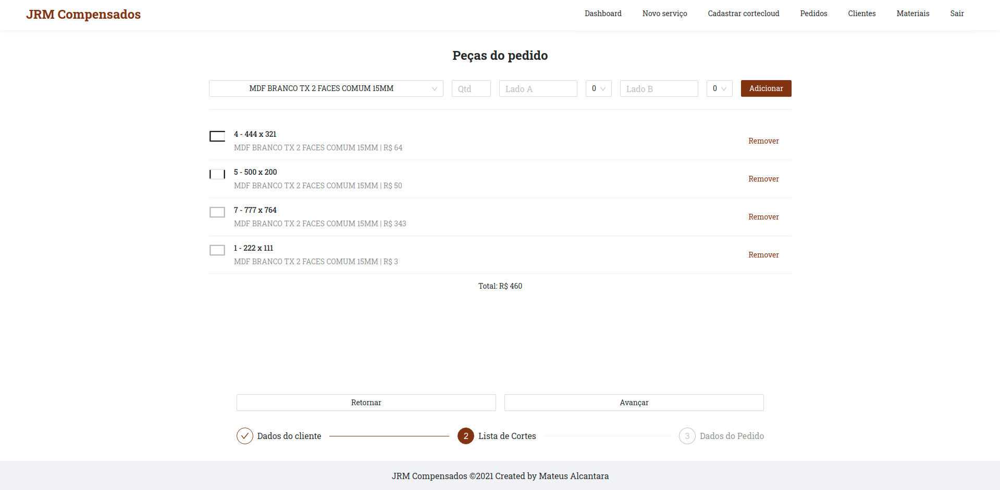

# JRM Web



This is the web client of the app JRM Compensados used to manage the company JRM Compensados. The project was created using Reactjs. Ps: If you want to run this project, you'll need to run the [backend](https://github.com/mat-alcantara/jrm-api) too.

## Built With

- Typescript
- Ant Design
- Axios
- Styled Components
- Date-fns
- Craco
- Yup
- React Router DOM
- React to Print

## Installation

1. Clone the repository

```bash
git clone https://github.com/mat-alcantara/jrm-web jrm-web
```

2. Go to project's folder

```bash
cd jrm-web
```

3. Install the dependencies

```bash
npm install
```

## Usage

Remember: To run this project, you'll need to run the [backend](https://github.com/mat-alcantara/jrm-api) in background.

Create a file .env in root and use .env.local variables.

After this, just run

```bash
npm run dev
```

---

Made by Mateus Alcantara 👋 &nbsp;[See my linkedin](https://www.linkedin.com/in/mat-alcantara/)
